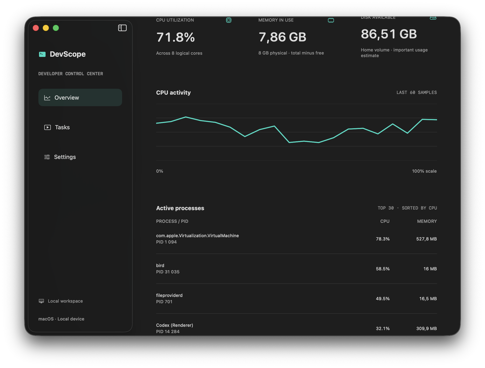

# DevScope

A native macOS developer control center built with SwiftUI and Swift concurrency. Observe system CPU, memory, disk availability and busy processes; save local scripts and run each with a confirmation; inspect output and persistent logs.



Screenshot captured from the running application on macOS; the values are a local point-in-time sample.

## Run

Requires macOS 13 or later and a Swift 6 toolchain (Xcode or Command Line Tools).

```sh
swift build
./scripts/test.sh
swift run DevScope

# Optional local application bundle
./scripts/package-app.sh
open dist/DevScope.app
```

You can build and run this SwiftPM executable with Command Line Tools. Xcode is optional for source inspection. This repository does not include an App Store signed bundle or an iOS target.

## Features

- Live aggregate CPU percentage from Mach host counters, with a 60-sample activity graph.
- Physical memory usage (total minus free pages), disk available capacity, and the 30 processes with the highest `ps` CPU usage.
- Saved `.sh` and `.command` scripts, file selection, visible file paths and an explicit confirmation on every run.
- A single running task at a time, Stop button, exit codes, stdout/stderr capture, and full log files in Application Support.
- Dark/light appearance and refresh intervals from 1 to 10 seconds, persisted locally.

The first CPU sample establishes a baseline. Memory is a coarse host metric and is not Activity Monitor's pressure metric. Process CPU can exceed 100% when a process uses several cores. Disk availability is macOS's important-usage estimate.

## Architecture

`DevScopeCore` owns Sendable models, parsers and actor-isolated monitoring and task execution. The SwiftUI target contains the main actor view model and views. `MonitoringService` reads Mach counters and executes `/bin/ps` without a shell. `TaskRunner` invokes `/bin/zsh` with the chosen script path as a separate argument and writes both output streams directly to a log file, avoiding pipe backpressure.

Adding a script never runs it. Confirmation is enforced by the UI before calling the runner. Scripts execute with the current user's permissions and may perform any action their contents request. The Stop button sends SIGTERM to the script process; descendants may continue. Output previews are limited to 1 MiB, while full logs have no configured size limit. Run summaries are session-only; script list, preferences and logs persist locally.

See [architecture](docs/ARCHITECTURE.md), [verification](docs/VERIFICATION.md) and [the sample script](examples/workspace-health.sh). No telemetry, cloud dependency or third-party package is required.

MIT © 2026 Borep1945.
