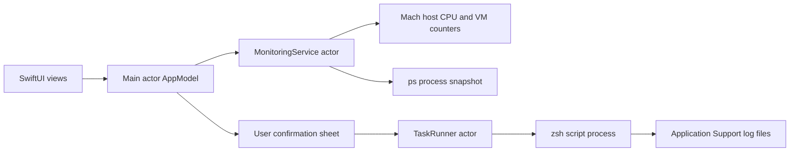

# Architecture and behavior

Sampling runs in an actor; view publication stays on the main actor. Task execution awaits a process termination continuation, allowing the actor to accept a stop request while execution continues. The log file receives both standard streams without in-memory buffering; only the first 1 MiB is loaded for display after completion.

Saved tasks contain IDs, names and absolute paths. UserDefaults stores their JSON and the appearance/refresh preferences. Logs use generated UUID filenames under `~/Library/Application Support/DevScope/logs`. Run results are kept for the current session, up to 50 entries. Delete log files manually from Finder when needed.

## Boundaries

- This is a local, unsandboxed developer executable. It does not elevate privileges.
- Users should inspect their chosen scripts; confirming a path does not attest to its contents or prevent another program modifying it later.
- Stop targets the parent process and cannot guarantee termination of its descendants.
- Host memory shows allocated physical pages, including caches and reclaimable memory.
- A process snapshot represents `ps` lifetime CPU accounting, rather than an instantaneous per-process delta.
- There is no network polling, account integration, background launch service or automatic script execution.

## Development

`./scripts/test.sh` covers parsing, CPU counter arithmetic including wraparound, persistence round trips, script exit/output/log behavior, stop and concurrent-run rejection, and an actual local system snapshot. The SwiftUI executable is separately compiled by `swift build`.
